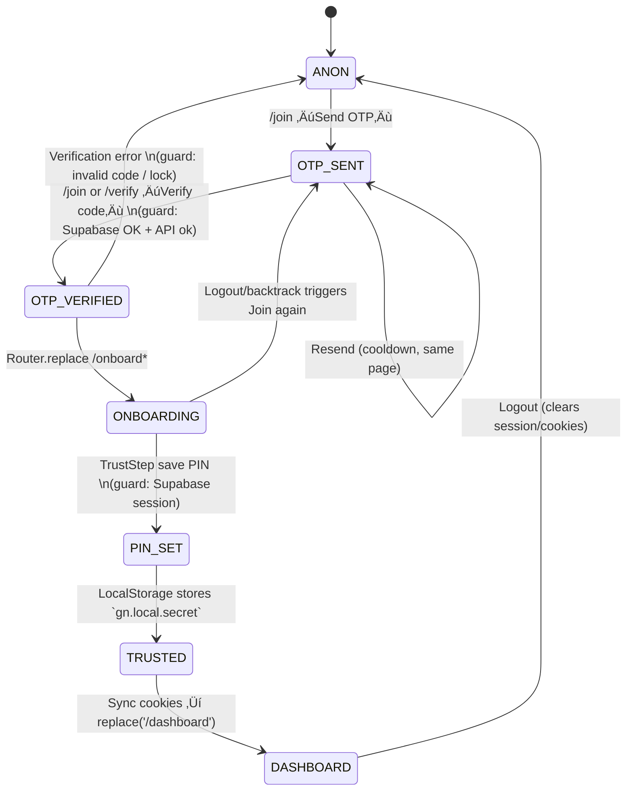

# 🧭 Gatishil Nepal Auth Control Tower

This control tower distills every moving part of Gatishil Nepal’s authentication story — from the first OTP request on `/join` to the cookies, local PIN, and dashboard session checks. Use it as a single-page radar for code owners, incident responders, and onboarding engineers.

## Auth Surface Inventory

### Routes & Pages
| File | Purpose | Key exports / functions | Invoked from | Redirect behavior |
| --- | --- | --- | --- | --- |
| `app/join/page.tsx` | Server entry that mounts the client-only join experience. | Default page component. | App Router for `/join`. | Defers to client logic for redirects. |
| `app/join/JoinClient.tsx` | Implements dual email/phone OTP flows, message UI, and redirect-on-session logic. | `JoinClient`, `sendPhoneOtp`, `verifyPhoneOtp`, `sendEmailOtp`, `verifyEmailOtp`. | Rendered by `/join`; phone talks to `/api/otp/phone/*` while email uses the Supabase browser client directly. | Redirects signed-in users to `/onboard?src=join`; phone verify replaces `/dashboard`, email verify replaces `/onboard?src=join`. |
| `app/verify/page.tsx` | Legacy `/verify` landing now acting as a kill-switch redirect. | Client component. | `/verify`. | Immediately redirects to `/join`. |
| `app/onboard/page.tsx` | Suspense shell around the onboarding flow. | Default page component with dynamic rendering. | `/onboard`. | None; onboarding flow drives navigation. |
| `components/OnboardingFlow.tsx` | Orchestrates multi-step onboarding, Supabase code exchange, and final Trust step. | `OnboardingFlow`. | Used by `/onboard`. | Exchanges `code` params for sessions; pushes between steps and finally `/dashboard`. |
| `components/onboard/NameFaceStep.jsx` | Captures name + selfie, uploads to Supabase Storage, and upserts profile. | `NameFaceStep`, `uploadAvatar`. | Loaded dynamically during onboarding. | Blocks progression until name + photo saved; stays on step otherwise. |
| `components/onboard/RootsStep.jsx` | Stores diaspora / homeland metadata in `profiles.roots_json`. | `RootsStep`. | Onboarding flow. | Prevents next step until selection saved; no external redirect. |
| `components/AtmaDisha/AtmaDisha.jsx` | Collects occupation, skills, passions, compassion, and vision. | `AtmaDisha`, `persist`. | Onboarding flow. | Calls `onDone` (→ Trust step) after saving; no direct navigation. |
| `components/onboard/TrustStep.jsx` | Final onboarding gate for PIN creation, cookie sync, and dashboard hop. | `TrustStep`, `savePin`, `syncToServerCookies`. | Onboarding flow. | After PIN save or reuse, syncs cookies then replaces to `/dashboard`. |
| `app/login/page.tsx` | Server wrapper that short-circuits logged-in visitors and renders login UI. | `LoginPage`, `safeNext`. | `/login`. | Redirects existing sessions to sanitized `next` or `/dashboard`. |
| `app/login/LoginClient.tsx` | Multifaceted login client (password, email OTP, magic link). | `LoginClient`, `onPasswordLogin`, `onOtpLogin`, `onMagicLink`. | Rendered by `/login`. | Pushes to validated `next` on success. |
| `app/auth/callback/page.tsx` | Server shell for OAuth/OTP callback. | Default page component. | `/auth/callback`. | None. |
| `app/auth/callback/Client.tsx` | Exchanges Supabase PKCE or token hash and syncs cookies before redirect. | `Client`. | Mounted on `/auth/callback`. | Redirects to `next` (default `/onboard?src=join`) after session sync. |
| `app/dashboard/page.tsx` | Server-rendered member console requiring Supabase session. | `DashboardPage`. | `/dashboard`. | Redirects anonymous users to `/login?next=/dashboard`. |
| `middleware.ts` | Global guard for `/onboard` and `/dashboard`. | `middleware`. | Runs on all edge requests. | `/onboard` without session → `/join`; `/dashboard` without or expired session → `/login?next=/dashboard`. |

### API Routes
| File | Purpose | Key exports / functions | Called by | Redirect / Side effects |
| --- | --- | --- | --- | --- |
| `app/api/otp/phone/send/route.ts` | Sends Nepal (+97797/98) SMS OTP via Aakash and logs hash-only entries to `public.otps`. | `POST` handler. | `/join` phone tab. | Returns `{ ok, message }`, enforces 30 s resend + 5 min TTL. |
| `app/api/otp/phone/verify/route.ts` | Verifies hashed phone OTPs, marks them used, and signs the alias email into Supabase. | `POST` handler. | `/join` phone verify flow. | Returns `{ ok, provider: 'phone', session }` with Supabase access/refresh tokens. |
| `app/api/otp/email/send/route.ts` | Legacy facade kept for backwards compatibility. | `POST` handler. | Any legacy callers. | Always returns 410 with `{ ok: false, error: 'EMAIL_ROUTE_CLIENT_ONLY' }`. |
| `app/api/otp/email/verify/route.ts` | Legacy facade mirroring the send route stance. | `POST` handler. | Any legacy callers. | Always returns 410 with `{ ok: false, error: 'EMAIL_ROUTE_CLIENT_ONLY' }`. |
| `app/api/auth/sync/route.ts` | Writes Supabase access/refresh tokens into secure cookies (plus legacy JSON). | `OPTIONS`, `POST`. | Login flows, TrustStep, Supabase browser sync. | No redirect; response `{ ok: true }` with Set-Cookie. |

### Shared Libraries & Utilities
| File | Purpose | Key exports | Consumed by | Notes |
| --- | --- | --- | --- | --- |
| `lib/supabaseClient.ts` | Client-only re-export of Supabase browser singleton. | `supabase`, `getSupabaseBrowser`. | Most client flows (Join, onboarding, login). | Wraps `lib/supabase/browser`. |
| `lib/supabase/browser.ts` | Creates singleton browser client and mirrors tokens into cookies. | `getSupabaseBrowser`, `supabase`. | Login & onboarding UIs. | Syncs via `/api/auth/sync` on sign-in/refresh. |
| `lib/supabase/server.ts` | SSR Supabase client respecting modern & legacy cookies. | `getSupabaseServer`. | `/dashboard`. | Reads `sb-*` cookies, falls back to legacy JSON. |
| `lib/supabaseServer.ts` | Older server helper with writeable cookies. | `getServerSupabase`. | `/login`. | Supports legacy cookie decoding. |
| `lib/auth/verifyOtpClient.ts` | Legacy browser helper for the old unified `/api/otp/verify` endpoint. | `verifyOtpAndSync`. | *(unused after OTP lane split)*. | Retained for reference; new flows call Supabase directly for email and `/api/otp/phone/verify` for SMS. |
| `lib/auth/waitForSession.ts` | Polls Supabase until a session appears. | `waitForSession`. | `verifyOtpAndSync`, `/join` email flow. | Returns tokens for cookie sync. |
| `lib/auth/next.ts` | Sanitizes `next` redirect values. | `getValidatedNext`. | `/login` client. | Blocks external redirects. |
| `lib/auth/validate.ts` | Shared identifier helpers (legacy). | `isPhone`, `isEmail`, `maskIdentifier`. | *(deprecated)*. | Left for potential reuse; not referenced in current flow. |
| `lib/constants/auth.ts` | OTP timing constants. | `OTP_TTL_SECONDS`, etc. | `/verify`. | 5-minute TTL, resend cooldown. |
| `lib/ui/OtpInput.tsx` | Reusable 6-digit OTP input. | `OtpInput`. | `/verify`. | Auto-focus & paste-friendly. |
| `lib/localPin.ts` | Local PIN storage using WebCrypto + localStorage. | `createLocalPin`, `hasLocalPin`, `unlockWithPin`. | TrustStep. | Stores secrets under `gn.local.*`. |

### Middleware, Hooks, and Extras
| File | Purpose | Key exports | Consumed by | Redirect behavior |
| --- | --- | --- | --- | --- |
| `hooks/useEnsureProfile.ts` | Creates minimal profile row after login (unused). | `useEnsureProfile`. | Not referenced currently. | n/a. |
| `app/status/page.tsx` (auth portion) | Uses `getSupabaseBrowserClient` to gate stats. | Page component. | `/status`. | None (informational). |

## Visual Panels

### Panel 1: Route-Guard Matrix

| Route | No Session | Session | Onboarding Done | PIN Set | Trusted Device |
| --- | --- | --- | --- | --- | --- |
| `/join` | allow | → `/onboard?src=join` (client redirect) | → `/onboard?src=join` (no dashboard fast-path) | → `/onboard?src=join` after PIN creation elsewhere | allow (PIN check is local only) |
| `/onboard` | → `/join` | allow | allow (no completion check) | allow | allow |
| `/login` | allow | allow (server redirect only if session detected) | allow | allow | allow |
| `/dashboard` | → `/login?next=/dashboard` | allow | allow (shows partial profile) | allow | allow |

### Panel 2: Redirect Truth Table

| User action | Has session? | Identifier status (+977 / email) | Code valid? | Attempts remaining | PIN / device trust | Cookies synced? |
| --- | --- | --- | --- | --- | --- | --- |
| Send phone OTP (`/join`) | Existing session triggers instant move to `/onboard?src=join`. | Normalised to `+97797/98…` or rejection message. | n/a | n/a | n/a | Persists to `public.otps`, enforces 30 s cooldown and 5 min TTL. |
| Verify phone OTP (`/join`) | Requires matching record in `public.otps`. | Phone only. | Match → `/dashboard`; mismatch → error toast, OTP remains unused. | Locks after 5 minutes (TTL) or once consumed. | n/a | API response includes Supabase tokens; Join client sets session then refreshes router. |
| Send email OTP (`/join`) | Existing session rerouted before action. | Email only. | n/a | n/a | n/a | Browser calls `supabase.auth.signInWithOtp`; UI mirrors 30 s resend timer. |
| Verify email OTP (`/join`) | Supabase browser client validates OTP and seeds session. | Email only. | Valid code → replace `/onboard?src=join`; invalid → error toast. | Supabase handles attempts internally. | n/a | `supabase.auth.verifyOtp` resolves locally; cookie sync handled by browser client listener. |
| Name & face “Continue” | Requires Supabase session to upload; absence throws “No session”. | n/a | n/a | n/a | n/a | Successful save leaves user on `/onboard?step=roots`. |
| Roots “Continue” | Needs Supabase session for profile update. | Chooses Nepal/Abroad meta. | n/a | n/a | n/a | Remains on `/onboard`, pushes to `step=atmadisha` on save. |
| Ātma Diśā finish | Session required to persist profile traits. | n/a | n/a | n/a | n/a | Calls `onDone` to enter Trust step; no redirect. |
| Save PIN (`TrustStep`) | Supabase session required for cookie sync. | n/a | n/a | n/a | Stores encrypted PIN in `localStorage`; sets toast. | Calls `/api/auth/sync`, then `replace('/dashboard')`. |
| Keep existing PIN | n/a | n/a | n/a | n/a | Requires `hasLocalPin()` true. | Syncs cookies, replaces `/dashboard`. |
| Password login (`/login`) | n/a | Email/password. | n/a | n/a | n/a | On success posts tokens to `/api/auth/sync`, `push(next)`. |
| Magic link request (`/login`) | n/a | Email. | n/a | n/a | n/a | Supabase sends link; UI shows “Magic link sent” toast. |
| OTP login (`/login`) | n/a | Email + code. | Valid → `verifyOtpAndSync` → `push(next)`; invalid → error toast. | Depends on `/api/otp/verify` rate limits. | n/a | Always syncs cookies via helper. |
| `/auth/callback` exchange | If already signed in, goes straight to `next`. | PKCE `code` or OTP `token_hash`. | Valid → session + cookie sync, redirect to `next`; invalid → error with CTA back to login. | n/a | n/a | Calls `/api/auth/sync` after obtaining tokens. |

### Panel 3: State Machine

### Panel 4: Request Swimlane

## Supporting Tables

### Data Contract Table
| Name | Shape | Set by | Consumed by | Notes |
| --- | --- | --- | --- | --- |
| `/api/otp/phone/send` request | `{ phone: string }` | Join client (phone tab) | Phone send route | Rejects anything outside `+97797/98…`; enforces 30 s throttle. |
| `/api/otp/phone/send` response | `{ ok: boolean, message?: string, ttlMinutes?: number, wait?: number }` | Phone send route | Join client UI | Drives resend timer + toast copy. |
| `/api/otp/phone/verify` request | `{ phone: string, code: string }` | Join client (phone verify) | Phone verify route | Requires six-digit code that matches latest unused hash. |
| `/api/otp/phone/verify` response | `{ ok: true, provider: 'phone', session: { access_token, refresh_token, expires_in, token_type } }` | Phone verify route | Join client | Tokens feed `supabase.auth.setSession` before redirect. |
| `/api/otp/email/send` | `{ ok: false, error: 'EMAIL_ROUTE_CLIENT_ONLY' }` | Email send facade | Legacy callers | Always 410 instructing clients to use Supabase browser SDK. |
| `/api/otp/email/verify` | `{ ok: false, error: 'EMAIL_ROUTE_CLIENT_ONLY' }` | Email verify facade | Legacy callers | Always 410 instructing clients to use Supabase browser SDK. |
| `/api/auth/sync` request | `{ access_token: string, refresh_token?: string|null }` | Login flows, TrustStep, browser sync | Auth sync route | Fails if `access_token` missing; sets modern + legacy cookies. |
| Supabase browser storage | `localStorage['gatishil.auth.token']` | Supabase client | Supabase auth refresh logic | Mirrors session for SPA persistence. |
| Local PIN | `localStorage['gn.local.secret']`, `['gn.local.salt']` | TrustStep | `hasLocalPin`, `unlockWithPin` | AES-GCM encrypted secret derived from PIN. |
| Session Storage | `sessionStorage['pending_id']` | (Legacy flows) | *(deprecated)* | Legacy placeholder removed; `/verify` now redirects to `/join`. |
| Cookies | `sb-access-token`, `sb-refresh-token`, `supabase-auth-token`, `webauthn_challenge` | Auth sync route, WebAuthn helpers | Middleware, server Supabase clients, WebAuthn flows | Legacy cookie ensures backward compatibility. |

### Risk Heatmap
| Risk | Impact | Evidence | Mitigation |
| --- | --- | --- | --- |
| Legacy alias phone accounts | Historical phone sign-ins stored pseudo `@gn.local` emails. | Prior implementation minted Supabase users via alias emails. | Current verifier nulls the email, sets the phone, and refreshes metadata; schedule one-time cleanup for members who never re-verify. |
| Email OTP path skips cookie sync | User reaches `/onboard` but server pages lack tokens. | Email verify previously bypassed cookie sync. | New client flow uses `supabase.auth.verifyOtp` and browser sync listener to POST `/api/auth/sync`.【F:app/join/JoinClient.tsx†L129-L180】【F:lib/supabase/browser.ts†L7-L44】 |
| Onboarding open to anonymous users | Unauthenticated visitors can hit `/onboard` and trigger storage errors. | Middleware treats `/onboard` as public.【F:middleware.ts†L13-L22】 | Add guard to redirect to `/join` when no Supabase session. |
| TrustStep fails without Supabase session | Cookie sync throws “No active session”, stranding users. | TrustStep fetches session before sync.【F:components/onboard/TrustStep.jsx†L8-L56】 | Surface retry, or ensure session establishment earlier. |
| Local PIN only client-side | No server validation; stolen device bypass possible. | PIN stored solely in localStorage.【F:lib/localPin.ts†L22-L49】 | Consider server challenge or WebAuthn enforcement. |
| Middleware trusts stale cookies | Stale/expired tokens still allow `/dashboard` fetch attempt. | Middleware checks only cookie presence.【F:middleware.ts†L24-L41】 | Validate token expiry via Supabase before allowing. |
| Callback without `code`/`token_hash` traps user | Shows error requiring manual navigation. | Auth callback demands query params.【F:app/auth/callback/Client.tsx†L49-L90】 | Provide fallback link to `/join` or auto-redirect after timeout. |

## How to debug safely

When a login attempt fails, start at `/join`: confirm `/api/otp/phone/send` responses and ensure the correct table receives the OTP. Follow the phone lane through `/api/otp/phone/verify` (checking that tokens return and cookies sync) while validating that email requests reach Supabase directly, then step into `/onboard` to verify profile writes, TrustStep PIN storage, and `/api/auth/sync` calls; finish by inspecting middleware + `/dashboard` server logs. This map lets you trace each hop without guessing which module redirects next or which storage layer (Supabase, cookies, local PIN) might be stale.
