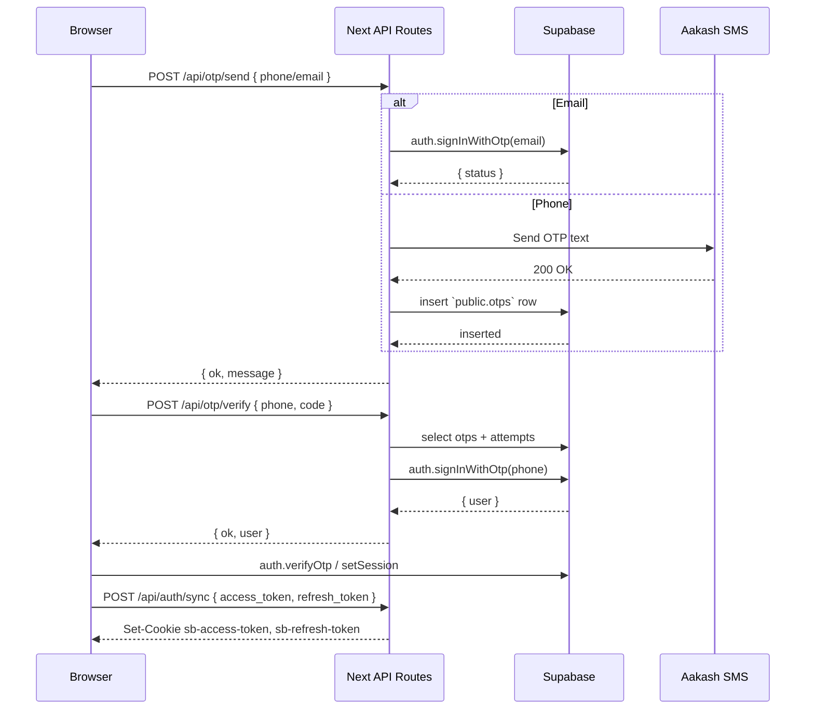

# Authentication Journey Schema

This document maps the end-to-end authentication journey for the Gatishil Nepal Next.js App Router + Supabase stack, from the public `/join` entry point through onboarding and trust establishment to the protected `/dashboard`, including supporting APIs, middleware, shared libraries, components, state, and data contracts.

## Routes

### `/join`
- [`/app/join/page.tsx`](app/join/page.tsx) → Renders the client wrapper; exports `Page` server component consumed by App Router.
- [`/app/join/JoinClient.tsx`](app/join/JoinClient.tsx) → Client UI/logic for unified OTP (phone or email).
  - **Purpose:** Collect phone/email, send OTP, verify code, and redirect (phone ➜ `/dashboard`, email ➜ `/onboard`).
  - **Key exports:** default `JoinClient` (Suspense-wrapped), internal helpers (`sendOtp`, `verifyOtp`, `sendEmailOtp`, `verifyEmailOtp`).
  - **Consumers:** `/join` page, indirectly influences `/verify`, `/onboard`, `/dashboard`.
  - **Supabase calls:**
    - `supabase.auth.getSession()` (pre-check, post-login fetch).
    - `supabase.auth.signInWithOtp({ email, shouldCreateUser: true })` for email send.
    - `supabase.auth.verifyOtp({ type: 'email' | 'sms', ... })` via email verify helper.
    - `supabase.auth.setSession({ access_token, refresh_token })` for phone OTP tokens (expects API response to include tokens).
    - Waits via `waitForSession` helper for email OTP.
  - **API dependencies:** Fetches `/api/otp/send` (phone), `/api/otp/verify` (phone), `/api/auth/sync` (after session), Supabase direct email OTP.
  - **Redirect logic:**
    - If a session already exists → `router.replace('/onboard?src=join')`.
    - Phone OTP success → `router.replace(next ?? '/onboard?src=join')` (server returns `/onboard?src=join`).
    - Email OTP success → `router.replace(next ?? '/onboard?src=join')` (shared onboarding path).
  - **State touched:**
    - Uses `localStorage` implicitly via Supabase auth storage key `gatishil.auth.token`.
    - Tracks OTP focus using refs; manages UI state (`tab`, `otpSentTo`, etc.).
    - Utilises environment `NEXT_PUBLIC_SITE_URL` for canonical host messaging.
    - Accepts query params via `useSearchParams` (currently unused).

### `/verify`
- [`/app/verify/page.tsx`](app/verify/page.tsx) → Legacy entry that immediately redirects to `/join`.
  - **Purpose:** Preserve old links while funnelling everyone into the unified `/join` flow.
  - **Key exports:** default client component with `window.location.replace('/join')`.

### `/onboard`
- [`/app/onboard/page.tsx`](app/onboard/page.tsx) → Suspense wrapper rendering `OnboardingFlow`.
- [`/components/OnboardingFlow.tsx`](components/OnboardingFlow.tsx) → Client router that orchestrates onboarding steps.
  - **Purpose:** Sequence steps (Welcome → Name → Roots → Ātma Diśā → Trust), handle PKCE/email `code` exchange, and manage navigation.
  - **Key exports:** default `OnboardingFlow` component; dynamic imports of child steps.
  - **Supabase calls:**
    - `supabase.auth.exchangeCodeForSession(code)` for OAuth/email callbacks.
    - `supabase.auth.getSession()` to confirm authentication.
  - **Redirect logic:**
    - Missing `code` → assumes session ready; else exchanges and sanitizes URL.
    - Final Trust step `onDone` → `router.push('/dashboard')`.
  - **State touched:** Reads `URLSearchParams` (`step`, `code`, `src`), updates query string via `router.push`; ensures `src` query persists.
- Step components:
  - [`/components/onboard/WelcomeStep.jsx`](components/onboard/WelcomeStep.jsx) → Static card with CTA; uses `OnboardCardLayout`.
  - [`/components/onboard/NameFaceStep.jsx`](components/onboard/NameFaceStep.jsx) → Collects name/photo, uploads to Supabase Storage bucket `avatars`, upserts `profiles` row.
    - Supabase: `auth.getSession`, `storage.from('avatars').upload`, `storage.getPublicUrl`, `from('profiles').upsert`.
    - State: Handles blob URLs, `toast`, `previewUrl`, `publicUrl`.
  - [`/components/onboard/RootsStep.jsx`](components/onboard/RootsStep.jsx) → Captures roots location.
    - Supabase: `auth.getSession`, `from('profiles').update` with `roots_json`.
    - Uses [`/components/ChautariLocationPicker.jsx`](components/ChautariLocationPicker.jsx) (detailed under Components).
  - [`/components/AtmaDisha/AtmaDisha.jsx`](components/AtmaDisha/AtmaDisha.jsx) → Collects occupations/skills/passion/compassion/vision.
    - Supabase: `auth.getSession`, `from('profiles').update` with arrays/vision string.
    - Loads options from [`/lib/atmaOptions.ts`](lib/atmaOptions.ts).
  - [`/components/onboard/TrustStep.jsx`](components/onboard/TrustStep.jsx) → Requests 4–8 digit PIN or reuse existing.
    - Supabase: `auth.getSession()` via `getSupabaseBrowser` (browser singleton).
    - Calls `/api/auth/sync` to persist cookies.
    - Local state: PIN form, toast, `existingPin` check via `hasLocalPin()`; writes encrypted secret via `createLocalPin()`.
    - Redirect: `router.replace('/dashboard')` and `router.refresh()` after sync.

### `/login`
- [`/app/login/page.tsx`](app/login/page.tsx) → Server component gating login; uses `getServerSupabase` to redirect authenticated users.
  - Redirect logic: If session exists → `redirect(validatedNext)`.
- [`/app/login/LoginClient.tsx`](app/login/LoginClient.tsx) → Client login form.
  - Supabase calls:
    - `auth.signInWithPassword`.
    - `auth.signInWithOtp({ email, options: { emailRedirectTo } })` for magic link.
  - Helpers: `getValidatedNext` ensures safe redirect; `verifyOtpAndSync` handles OTP login path.
  - API dependencies: `/api/auth/sync` after password login; `/api/otp/verify` indirectly via `verifyOtpAndSync`.
  - State: Email/password/OTP inputs, `message`, `error`, `loading`.

### `/dashboard`
- [`/app/dashboard/page.tsx`](app/dashboard/page.tsx) → Server-only protected page.
  - Supabase: `auth.getUser()`; fetches `profiles` and `user_person_links` rows.
  - Redirect logic: No user → `redirect('/login?next=/dashboard')`.
  - State: None client-side; relies on cookies for auth.

### Callback & Supporting Routes
- [`/app/auth/callback/page.tsx`](app/auth/callback/page.tsx) & [`/app/auth/callback/Client.tsx`](app/auth/callback/Client.tsx)
  - Purpose: Handle Supabase PKCE, magic link, or OTP callbacks by exchanging `code` or `token_hash`, then syncing cookies and redirecting to `next` (default `/onboard?src=join`).
  - Supabase: `auth.getSession`, `auth.exchangeCodeForSession`, `verifyOtpAndSync` helper.
  - API: `/api/auth/sync` for cookie writing.
  - Redirect logic: On success `router.replace(next)`; on failure provides `/login?next=…` link.

## API

- [`/app/api/otp/send/route.ts`](app/api/otp/send/route.ts)
  - **Purpose:** Accepts email or +977 phone to send OTP (Supabase email OTP or Aakash SMS + Supabase table).
  - **Supabase calls:**
    - `createClient(...).auth.signInWithOtp` (anon key) for email; persists phone OTPs via service role `from('otps').insert`.
  - **External services:** `https://sms.aakashsms.com/sms/v3/send` using `AAKASH_SMS_API_KEY` and `AAKASH_SENDER_ID`.
  - **Env vars:** `NEXT_PUBLIC_SUPABASE_URL`, `NEXT_PUBLIC_SUPABASE_ANON_KEY`, `SUPABASE_SERVICE_ROLE`, `NEXT_PUBLIC_SITE_URL`, `AAKASH_SMS_API_KEY`, `AAKASH_SENDER_ID`.
  - **State/headers:** Requires `x-idempotency-key`; returns JSON `ok`, `channel`, `message`.

- [`/app/api/otp/verify/route.ts`](app/api/otp/verify/route.ts)
  - **Purpose:** Validate phone OTP (from `otps` table), enforce lockout, and initiate Supabase sign-in via SMS.
  - **Supabase calls:**
    - Service role `from('otp_attempts')`, `from('otps')` selects/updates; `auth.signInWithOtp({ phone })`.
  - **Env vars:** `NEXT_PUBLIC_SUPABASE_URL`, `SUPABASE_SERVICE_ROLE`.
  - **State:** Returns `{ ok: true, user }` on success (no access/refresh tokens) — mismatch with `JoinClient.verifyOtp` expectation.
  - **Locking:** 5 failed attempts → locks for 2 minutes (status 423).

- [`/app/api/auth/sync/route.ts`](app/api/auth/sync/route.ts)
  - **Purpose:** Accepts `access_token` and optional `refresh_token`, sets httpOnly cookies (`sb-access-token`, `sb-refresh-token`, legacy `supabase-auth-token`).
  - **Consumers:** `JoinClient`, `LoginClient`, `TrustStep`, `verifyOtpAndSync`, `auth/callback`.
  - **State:** Writes secure, lax cookies with 1h/30d lifetimes.

## Middleware/Guards

- [`/middleware.ts`](middleware.ts)
  - **Purpose:** Gate `/dashboard` (and future private paths) based on Supabase cookies.
  - **Logic:** Allows public prefixes (`/join`, `/verify`, `/onboard`, `/login`, `/health`, `/otp`); if no `sb-access-token` or `supabase-auth-token` JSON with `access_token`, redirects to `/login?next=…`.
  - **State:** Reads cookies; rewrites query string to preserve original `pathname + search`.

- [`/lib/requireSessionUser.ts`](lib/requireSessionUser.ts)
  - **Purpose:** Helper for API/server utilities to enforce Supabase session via `createRouteHandlerClient({ cookies })`.
  - **Usage:** Not referenced in listed flow but available for guarded routes.

- [`/lib/auth/next.ts`](lib/auth/next.ts)
  - **Purpose:** Sanitize `next` redirects to internal paths only.
  - **Consumers:** `LoginClient`, can be used elsewhere for safe redirect.

## Components

- [`/lib/ui/OtpInput.tsx`](lib/ui/OtpInput.tsx)
  - **Purpose:** 6-digit OTP input with auto-focus and navigation.
  - **Consumers:** `/verify` route.

- [`/components/onboard/OnboardCardLayout.jsx`](components/onboard/OnboardCardLayout.jsx) *(implied use across steps; contains card styling).* 

- [`/components/onboard/CameraCapture.jsx`](components/onboard/CameraCapture.jsx) & [`/components/onboard/ImageEditor.jsx`](components/onboard/ImageEditor.jsx)
  - **Purpose:** Support photo capture/cropping before uploading in `NameFaceStep`.

- [`/components/ChautariLocationPicker.jsx`](components/ChautariLocationPicker.jsx)
  - **Purpose:** Fetch hierarchical geo data from Supabase (provinces/districts/etc.) or abroad locations; allows ad-hoc inserts.
  - **State:** Tracks numerous selectors; calls Supabase `from()` queries and inserts for `toles`/`cities`.

- [`/components/onboard/ProgressDots.jsx`](components/onboard/ProgressDots.jsx) *(visual progress used within steps).* 

- [`/components/onboard/TrustStep.jsx`](components/onboard/TrustStep.jsx)
  - See `/onboard` section above for detailed logic.

- [`/components/onboard/NameFaceStep.jsx`](components/onboard/NameFaceStep.jsx), [`/components/onboard/RootsStep.jsx`](components/onboard/RootsStep.jsx), [`/components/AtmaDisha/AtmaDisha.jsx`](components/AtmaDisha/AtmaDisha.jsx), [`/components/onboard/WelcomeStep.jsx`](components/onboard/WelcomeStep.jsx) (core onboarding UI + persistence).

- [`/components/onboard/TrustStep.jsx`](components/onboard/TrustStep.jsx) also introduces toasts and PIN storage effects.

## Libs

### Supabase Clients & Helpers
- [`/lib/supabase/browser.ts`](lib/supabase/browser.ts)
  - Singleton browser client via `createBrowserClient`; auto-syncs cookies by POSTing to `/api/auth/sync` on sign-in/refresh.
  - Exported as `supabase` and `getSupabaseBrowser`; storage key `gatishil.auth.token`.

- [`/lib/supabase/client.ts`](lib/supabase/client.ts)
  - Alternative browser client with `detectSessionInUrl: false`; exports `supabase` and `resetLocalSessionIfInvalid` utility.

- [`/lib/supabaseClient.ts`](lib/supabaseClient.ts)
  - Client-side re-export bridging legacy imports to `/lib/supabase/browser`.

- [`/lib/supabaseBrowser.ts`](lib/supabaseBrowser.ts)
  - Compatibility layer re-exporting `getSupabaseBrowser` / `supabase`.

- [`/lib/supabase/server.ts`](lib/supabase/server.ts)
  - Server helper reading `sb-access-token` and legacy JSON cookie; uses `createServerClient` without mutating cookies.

- [`/lib/supabaseServer.ts`](lib/supabaseServer.ts)
  - App-specific server helper with read/write cookie support; used in `/login`.

- [`/lib/auth/waitForSession.ts`](lib/auth/waitForSession.ts)
  - Polls `supabase.auth.getSession()` up to N times; returns `{ access_token, refresh_token }`.
  - **Consumers:** `verifyOtpAndSync`, `JoinClient` (indirect via helper).

- [`/lib/auth/verifyOtpClient.ts`](lib/auth/verifyOtpClient.ts)
  - Calls `/api/otp/verify`, waits for session, then syncs cookies to server.
  - **Consumers:** `JoinClient`, `LoginClient`.

- [`/lib/auth/validate.ts`](lib/auth/validate.ts)
  - Email/phone validators and `maskIdentifier` for UI.
  - **Consumers:** *(deprecated)*.

- [`/lib/auth/phone.ts`](lib/auth/phone.ts)
  - Nepal mobile regex + normalizer (not directly used in listed flow but relevant for OTP data integrity).

- [`/lib/localPin.ts`](lib/localPin.ts)
  - Handles encrypted local PIN storage in `localStorage` under keys `gn.local.secret` and `gn.local.salt`; exports `hasLocalPin`, `createLocalPin`, `unlockWithPin`.
  - **Consumers:** `TrustStep`.

- [`/lib/constants/auth.ts`](lib/constants/auth.ts)
  - Provides `OTP_TTL_SECONDS`, `OTP_RESEND_SECONDS`, `OTP_MAX_ATTEMPTS`, `SOFT_LOCK_SECONDS`.
  - **Consumers:** *(deprecated)*.

- [`/lib/atmaOptions.ts`](lib/atmaOptions.ts)
  - Supplies default Ātma Diśā options and loader hooking into Supabase tables (occupation/skills etc.).

- [`/hooks/useEnsureProfile.ts`](hooks/useEnsureProfile.ts)
  - Client hook ensuring `profiles` row exists for logged-in user; not auto-attached to flow but relevant for onboarding completeness.

## Data Contracts

| Name | Producer | Consumer | Shape / Fields | Notes |
| --- | --- | --- | --- | --- |
| OTP Send (Email) Request | `/join/JoinClient.sendEmailOtp` (browser) | `/app/api/otp/send` | `{ email: string }` | Supabase `signInWithOtp` with `shouldCreateUser: true`; expects 200 with `{ ok: true, channel: 'email' }`.
| OTP Send (Phone) Request | `/join/JoinClient.sendOtp` | `/app/api/otp/send` | `{ phone: string }` | Validates +977; API stores OTP in `public.otps` and sends SMS via Aakash.
| OTP Send Response | `/app/api/otp/send` | `/join/JoinClient` | `{ ok: boolean; channel: 'email'|'sms'; sent?: boolean; message: string; reason?: string }` | Generic errors hide enumeration (privacy message in UI).
| OTP Verify (Phone) Request | `/join/JoinClient.verifyPhoneOtp`, `verifyOtpAndSync` | `/app/api/otp/verify` | `{ phone: string; code: string }` | Requires 6-digit code; API returns `{ ok: true }` when code valid.
| OTP Verify Response | `/app/api/otp/verify` | `/join/JoinClient`, `verifyOtpAndSync` | `{ ok: boolean; message?: string }` | No tokens returned; client calls Supabase `verifyOtp` then `/api/auth/sync`.
| Email OTP Verify | `supabase.auth.verifyOtp` | Supabase Auth | `{ type: 'email', email, token }` | Returns `{ data, error }`; success populates client session.
| Magic Link Callback | Supabase redirect to `/auth/callback` | `/auth/callback/Client` | URL params `code`, `token_hash`, `next` | `next` sanitized default `/onboard?src=join`.
| Cookie Sync Payload | `JoinClient`, `LoginClient`, `TrustStep`, `verifyOtpAndSync`, `/auth/callback` | `/app/api/auth/sync` | `{ access_token: string; refresh_token?: string | null }` | Writes `sb-access-token` (1h), `sb-refresh-token` (30d), `supabase-auth-token` JSON.
| Supabase Session Object | Supabase | `waitForSession`, `TrustStep.syncToServerCookies` | `{ access_token: string; refresh_token: string | null }` | Derived via `supabase.auth.getSession()`.
| Local PIN Secret | `TrustStep` | `lib/localPin` | `localStorage['gn.local.secret'] = JSON.stringify({ iv:number[], ct:number[] })` | Encrypted secret; SALT stored as `gn.local.salt`.
| Supabase Storage Key | `lib/supabase/browser` | Browser `localStorage` | key `gatishil.auth.token` | Contains Supabase session (JSON string) for client persistence.
| Session Storage Pending ID | *(Deprecated)* | *(n/a)* | `sessionStorage['pending_id']` | Legacy artifact; `/verify` no longer consumes it.

## Mermaid: User Journey

```mermaid
flowchart LR
  A([Visitor opens /join]) --> B{Choose OTP channel}
  B -->|Phone +977| C[Call /api/otp/send]
  C --> D[Receive SMS]
  D --> E[Submit code via /api/otp/verify]
  E --> F[Supabase auth.setSession]
  F --> G[Sync tokens via /api/auth/sync]
  B -->|Email| K[Supabase signInWithOtp email]
  K --> L[Enter code in Join]
  L --> M[supabase.auth.verifyOtp]
  M --> N[waitForSession -> /onboard?src=join]
  G --> N
  N --> O[Welcome]
  O --> P[Name & Photo upload]
  P --> Q[Roots location]
  Q --> R[Ātma Diśā inputs]
  R --> S[Trust Step PIN -> createLocalPin + sync cookies]
  S --> T[/dashboard]
```

## Mermaid: Request Swimlane



## Mermaid: Dependency Graph

```mermaid
graph TD
  app_join_page --> app_join_client
  app_join_client --> lib_supabaseClient
  app_join_client --> app_api_otp_send
  app_join_client --> app_api_otp_verify
  app_join_client --> app_api_auth_sync
  app_join_client --> lib_auth_waitForSession
  app_join_client --> lib_auth_verifyOtpClient
  app_join_client --> app_data_countries

  app_verify_page --> app_verify_client
  app_verify_client --> lib_ui_OtpInput
  app_verify_client --> lib_supabase_client_ts
  app_verify_client --> lib_auth_validate
  app_verify_client --> lib_constants_auth

  app_onboard_page --> components_OnboardingFlow
  components_OnboardingFlow --> lib_supabaseClient
  components_OnboardingFlow --> components_onboard_WelcomeStep
  components_OnboardingFlow --> components_onboard_NameFaceStep
  components_OnboardingFlow --> components_onboard_RootsStep
  components_OnboardingFlow --> components_AtmaDisha
  components_OnboardingFlow --> components_onboard_TrustStep

  components_onboard_NameFaceStep --> lib_supabaseClient
  components_onboard_NameFaceStep --> components_onboard_CameraCapture
  components_onboard_NameFaceStep --> components_onboard_ImageEditor

  components_onboard_RootsStep --> lib_supabaseClient
  components_onboard_RootsStep --> components_ChautariLocationPicker

  components_onboard_TrustStep --> lib_localPin
  components_onboard_TrustStep --> lib_supabaseClient
  components_onboard_TrustStep --> app_api_auth_sync

  components_ChautariLocationPicker --> lib_supabaseClient

  app_login_page --> lib_supabaseServer_ts
  app_login_page --> app_login_client
  app_login_client --> lib_supabaseClient
  app_login_client --> lib_auth_next
  app_login_client --> lib_auth_verifyOtpClient
  app_login_client --> app_api_auth_sync

  app_dashboard_page --> lib_supabase_server_ts
  middleware --> app_dashboard_page
  middleware --> app_login_page
```



## Edge Cases & Risks

- `JoinClient.verifyOtp` expects `access_token`/`refresh_token` in `/api/otp/verify` response, but API returns only `{ user }`; phone OTP flow cannot complete session without modification.
- `/verify` relies on `sessionStorage.pending_id`, yet no file sets it; users landing here cannot verify.
- Phone OTP restricts to `+977`; Join UI warns but API also enforces, so diaspora numbers are blocked.
- `waitForSession` loops for up to 8s (Join) or 5s (default) — slow Supabase responses risk false negatives and error toasts.
- `/app/api/otp/verify` shares lockout state across attempts but does not normalize phone numbers; formatting mismatch (e.g., spaces) could bypass lock accounting if API is called differently.
- Middleware only checks cookies; if `/api/auth/sync` fails silently, server components may redirect back to login causing circular loops.
- TrustStep PIN relies on Web Crypto; unsupported browsers throw and block completion.
- Email OTP branch directs to `/onboard`, but phone branch jumps straight to `/dashboard`, bypassing onboarding + PIN creation.
- Resend timers (`OTP_RESEND_SECONDS`) rely on client state; page reload resets countdown, allowing quicker resends.
- Error messages from `JoinClient` log raw HTTP errors to console; while UI is generic, server logs may expose specifics.

## Gaps

- No implementation sets `sessionStorage.pending_id` required by `/verify`.
- `/app/api/otp/verify` does not issue access/refresh tokens needed by `JoinClient.verifyOtp`; session cannot be established for phone OTP.
- Passkey helpers removed — trust step now PIN-only; `/security` surfaces should reference PIN.

## Glossary

- **Supabase session:** `{ access_token, refresh_token }` pair returned by Supabase Auth; persisted client-side and synced to cookies for SSR.
- **OTP (One-Time Password):** 6-digit verification code sent via email or SMS, valid for ~5 minutes (`OTP_TTL_SECONDS`).
- **Aakash SMS:** External SMS gateway used for Nepali phone OTP delivery.
- **Ātma Diśā:** Onboarding step capturing occupation/skills/passion/compassion/vision for member profile enrichment.
- **Trust PIN:** 4–8 digit local fallback credential stored encrypted in `localStorage` (`gn.local.secret` / `gn.local.salt`).
- **`supabase-auth-token`:** Legacy JSON cookie `{ access_token, refresh_token }` maintained alongside modern `sb-*` cookies.
- **`getValidatedNext`:** Helper ensuring redirect targets remain within site boundaries.

